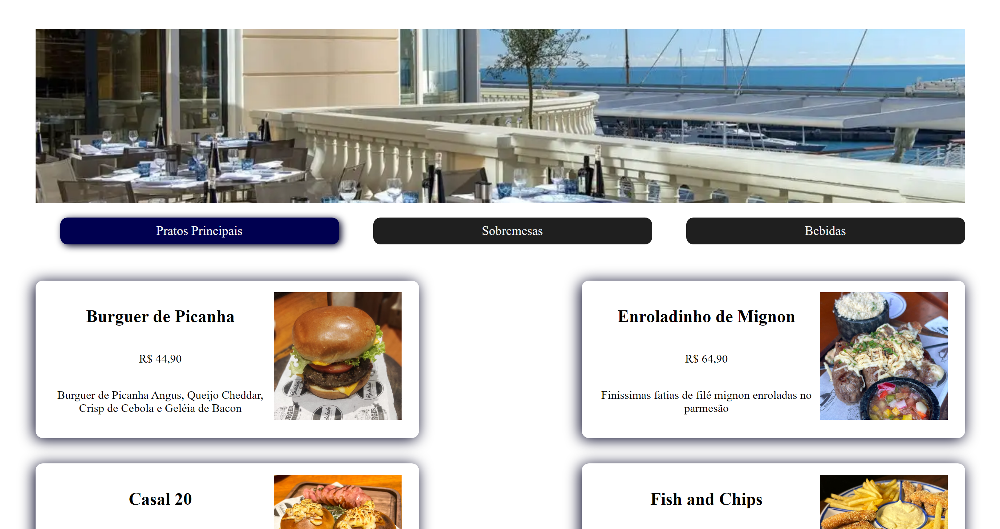

# Cardápio Digital

Criado um cardápio digital completo com React.JS no Intensivão da [Hashtag Programação](https://www.hashtagtreinamentos.com/).

[Projeto online](https://barbaraishioka.github.io/hashtag-javascript/cardapio-digital)



## Tecnologias

- HTML
- CSS
- Javascript
- React.JS

## Instalação

```bash
git clone https://github.com/barbaraishioka/hashtag-javascript/cardapio-digital

cd hashtag-javascript/cardapio-digital

npm install

npm run dev
```

## Licença

Este projeto está licenciado sob os termos da Licença MIT.
