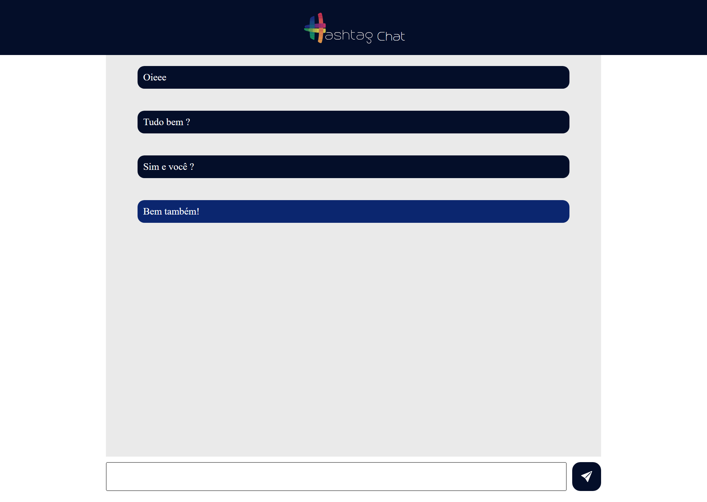

# Chat Page

Criado um chat utilizando express e socket.io no Intensivão da [Hashtag Programação](https://www.hashtagtreinamentos.com/).

[Projeto online]()



## Tecnologias

- HTML
- CSS
- Javascript

## Instalação

```bash

git clone https://github.com/barbaraishioka/hashtag-javascript/chat-page

cd hashtag-javascript/chat-page

npm init -y
npm install express
npm install socket.io
node --watch ./server.js

http://localhost:1000/

```

## Licença

Este projeto está licenciado sob os termos da Licença MIT.
