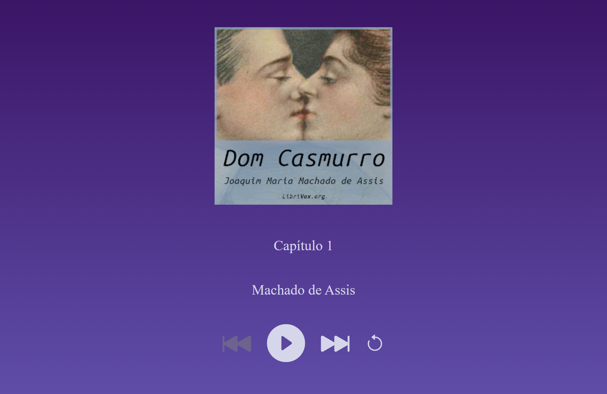
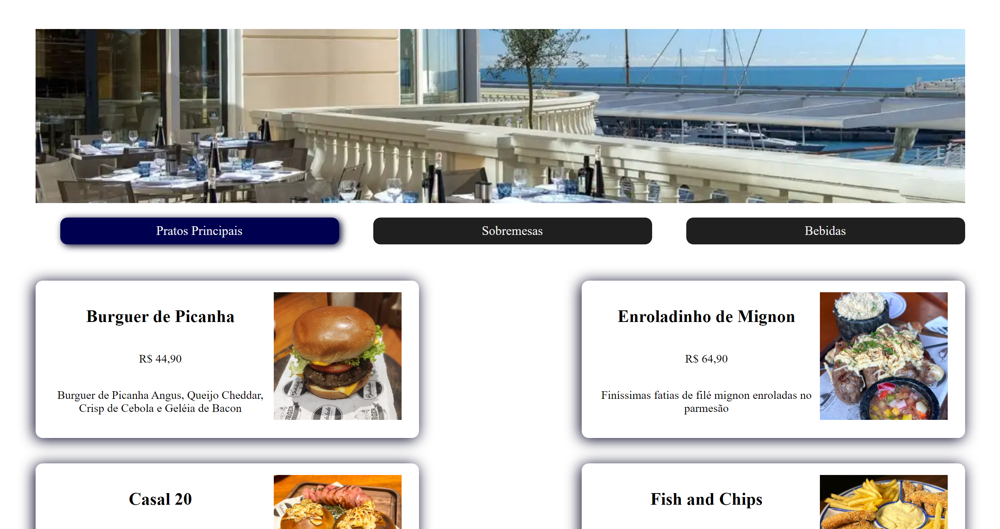

<h1>Projetos do Intensivão Javascript da <a href="https://www.hashtagtreinamentos.com/">Hashtag Programação</a></h1>

  

    Projetos desenvolvidos durante as aulas do intensivão Javascript 29/01/2024 - 01/02/2024.
  

   

  <table>
    <thead>
      <tr>
        <th align="center">#</th>
        <th align="center">Projeto</th>
        <th align="center">Online</th>
      </tr>
    </thead>
    <tbody>
      <tr>
        <td>01</td>
        <td><a href="./audio-book/">Áudio Book</a></td>
        <td align="center">
          
        </td>
      </tr>
      <tr>
        <td>02</td>
        <td><a href="./apple-watch-shop/">Apple Watch Shop</a></td>
        <td align="center">
          
        </td>
      </tr>
      <tr>
        <td>03</td>
        <td><a href="./cardapio-digital/">Cardápio Digital</a></td>
        <td align="center">
          
        </td>
      </tr>
    </tbody>

  </table>

   
